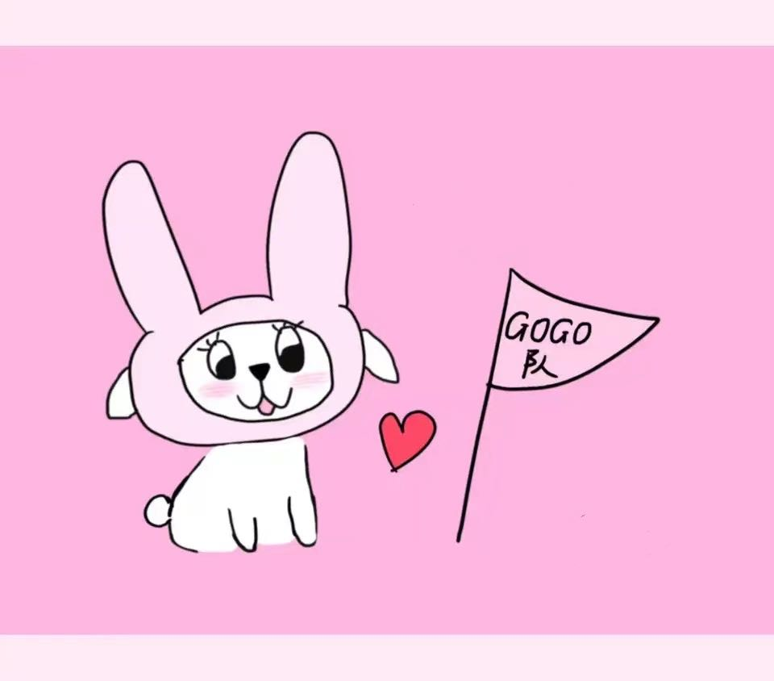

## 实验要求

1. 搭建Web服务器（自由选择系统），并制作简单的Web页面，包含简单文本信息（至少包含专业、学号、姓名）和自己的LOGO。
2. 通过浏览器获取自己编写的Web页面，使用Wireshark捕获浏览器与Web服务器的交互过程，并进行简单的分析说明。
3. 提交实验报告。

## 实验环境

系统：GUN/Linux Ubuntu 22.04

服务器搭建：Apache2

浏览器：chrome

## web serve的搭建和web页面的编写

使用以下命令部署web server：

```bash
sudo apt-get install apache2 -y
sudo systemctl enable apache2
```

然后在浏览器内输入本机ip（Linux下使用`ifconfig`查看），就可以看到路径为`/var/www/html/index.html`的web页面。

修改`.html`文件为：

```html
<!DOCTYPE html>
<html lang="en">
<head>
    <meta charset="UTF-8">
    <title>
        Network Lab
    </title>
</head>

<body>
    <p>
        王浩 2013287 <br>
        计算机科学与技术 <br>
    </p>
    <!-- 图片 img -->
    
</body>
</html>
```

再输入本机ip，就可以看到新页面，该页面部署在本地ip、80端口上：


## Wireshark抓包

由于此次抓包分析的source和destination都是本地，所以在监听网卡中选择`Loopback`。

然后访问web页面，得到如下抓包结果：


令人困惑的是，似乎有两个端口请求了web页面，分别filter一下，得到：

（45718 port 与 80 port）


（45730 port 与 80 port）


首先，为什么一个http请求会出现两个端口？

回答这个问题时参考了一篇文章：https://zhuanlan.zhihu.com/p/330300133

原因是在HTTP/1.1协议中没有实现**多路复用（multiplexing）**机制，它不能在传输过程中轮流传输不同文件的片（pieces）（因为HTTP/1.1只是纯文本协议，没法区分每个piece属于哪个stream。HTTP/2解决这个问题的办法是在每个packet中加入DATA frame，里面标识了stream id，于是不同文件的片也可以轮流传输了，但这样仍然会有TCP造成的队头阻塞……），所以只能按`A文件->B文件->C文件……`的顺序完整地传完每个文件的片。这样，当A特别大时，就会对后面的文件请求造成**队头阻塞（Head-of-Line blocking）**。

浏览器解决这个问题的办法是，在请求HTTP/1.1协议时，同时建立许多并行的TCP连接（查资料说一般最少都是6个，可是为什么我这里只有2个？）以分布不同的请求。

但是由于我的网页所需要的传输请求流量较小，所以实际上在传输过程中用到的只有`45718 port`，之后的分析也只针对这一端口展开。

## HTTP请求过程中的协议分析


对于每一个捕获的PDU，都可以看到每一层中的协议信息，从上到下就是物理层-链路层-网络层-传输层-应用层的协议信息。本文只分析传输层和应用层的内容。

### 传输层协议分析


Flags是标志位，在进行一些特殊请求时（比如握手、挥手）某些标志位就会发生变化

window是表示“当前主机所能接受的最大数据”，它与滑动窗口和上层应用程序的数据处理速度有关。


前三行是握手：

- ACK：确认标志。表明确认编号栏有效。大多数情况下该标志位是置位的。TCP报头内的确认编号栏内包含的确认编号（Ack）为下一个预期的序列编号（Seq），同时提示远端系统已经成功接收所有数据。
- SYN：同步标志。表明同步序列编号栏有效。该标志仅在三次握手建立TCP连接时有效。它提示TCP连接的服务端检查序列编号，该序列编号为TCP连接初始端（一般是客户端）的初始序列编号。

1. 第一次握手：客户端发送报文：SYN = 1, seq = x，进入STN_SENT状态
2. 第二次握手：服务器端发送报文：ACK = 1, SYN = 1, seq = y, ack = x + 1，进入SYN_RCVD状态
3. 第三次握手：客户端发送报文：ACK = 1, seq = x + 1, ack = y + 1，进入ESTABLISHED状态，服务器端收到后，也进入ESTABLISHED状态


后四行是挥手：

1. 第一次挥手：客户端发送报文：FIN = 1, ACK = 1, seq = x，进入FIN_WAIT_1状态

2. 第二次挥手：服务器端收到报文，发送报文：ACK = 1, seq = y, ack = x + 1，告诉客户端，我知道你要关闭了，等我处理一下数据，之后进入CLOSE_WAIT状态；客户端收到报文后进入FIN_WAIT_2状态

3. 第三次挥手：服务器端发送报文：FIN = 1, ACK = 1, seq = z, ack = x + 1，进入LAST_ACK状态

4. 第四次挥手：客户端收到报文，发送报文：ACK = 1, seq = x + 1, ack = z + 1之后进入TIME_WAIT状态；服务器端受到后进入CLOSED状态，客户端进入TIME_WAIT状态等待2MSL（报文最大生存时间）后也进入CLOSED状态

   为什么要等2MSL？

   - 客户端可以确保没有接受到服务器端的FIN报文，因此确认服务器端受到了最后的ACK报文
   - 2MSL足够让所有在传输过程中的报文被丢弃，避免以下情况：客户端CLOSED后又在同一个端口与服务器端建立连接，此时有一个迟到的报文到达了服务器端，服务器端就会认为这是新连接下的客户端发送的


### 应用层协议分析


可以选中某一个HTTP协议数据单元然后`右键-追踪流-HTTP流`，便于查看

从NO.4开始：

```http
GET / HTTP/1.1
Host: 10.136.157.162
Connection: keep-alive
Upgrade-Insecure-Requests: 1
User-Agent: Mozilla/5.0 (X11; Linux x86_64) AppleWebKit/537.36 (KHTML, like Gecko) Chrome/106.0.0.0 Safari/537.36
Accept: text/html,application/xhtml+xml,application/xml;q=0.9,image/avif,image/webp,image/apng,*/*;q=0.8,application/signed-exchange;v=b3;q=0.9
Accept-Encoding: gzip, deflate
Accept-Language: en-US,en;q=0.9,zh-CN;q=0.8,zh;q=0.7
```

客户端向服务器端发送方法为GET的请求报文，头部信息包含了客户端的一些信息，服务器端发送ACK响应，并发送响应报文，由请求行、头部信息、实体层组成（NO.6）：

```http
HTTP/1.1 200 OK
Date: Fri, 28 Oct 2022 03:38:56 GMT
Server: Apache/2.4.52 (Ubuntu)
Last-Modified: Fri, 28 Oct 2022 03:36:20 GMT
ETag: "146-5ec0ff60f7e3c-gzip"
Accept-Ranges: bytes
Vary: Accept-Encoding
Content-Encoding: gzip
Content-Length: 260
Keep-Alive: timeout=5, max=100
Connection: Keep-Alive
Content-Type: text/html

（接下来的实体层略，是这个web的html语言）
```

客户端收到后发送ACK，由于html语言中有`logo.jpg`，于是客户端继续请求`logo.jpg`（NO.11）：

```http
GET /logo.jpg HTTP/1.1
Host: 10.136.157.162
Connection: keep-alive
User-Agent: Mozilla/5.0 (X11; Linux x86_64) AppleWebKit/537.36 (KHTML, like Gecko) Chrome/106.0.0.0 Safari/537.36
Accept: image/avif,image/webp,image/apng,image/svg+xml,image/*,*/*;q=0.8
Referer: http://10.136.157.162/
Accept-Encoding: gzip, deflate
Accept-Language: en-US,en;q=0.9,zh-CN;q=0.8,zh;q=0.7
```

服务器端收到后发送ACK，并发送响应报文（NO.13）：

```http
HTTP/1.1 200 OK
Date: Fri, 28 Oct 2022 03:38:56 GMT
Server: Apache/2.4.52 (Ubuntu)
Last-Modified: Fri, 28 Oct 2022 03:32:37 GMT
ETag: "a918-5ec0fe8c8003c"
Accept-Ranges: bytes
Content-Length: 43288
Keep-Alive: timeout=5, max=99
Connection: Keep-Alive
Content-Type: image/jpeg

（实体层略，是这张图片的编码数据）
```

客户端收到后发送ACK。接下来客户端`GET /favicon.ico`，服务器端没找到，发送了状态码为404的响应报文。

之后进入四次挥手（见上文）。

## 附录（学习wireshark时的一些笔记，可忽略）

TCP协议介绍：https://www.jianshu.com/p/ef892323e68f

首先使用`ifconfig`命令查看本机网卡为：`wlp0s20f3`

可以在捕获-选项里选择“混杂模式”或“普通模式”：

- 混杂模式：接受所有经过网卡的数据包，包括不是发给本机的包，即不验证MAC地址。
- 普通模式：网卡只接受发给本机的包（包括广播包）。

筛选（过滤）：

- 用协议筛选

- 用原ip地址、目标ip地址筛选：

  `ip.src_host == 10.130.173.7 or ip.dst_host == 192.168.1.1`

  `ip.addr == 10.130.173.7`，不区分原地址和目标地址

## 问题


在学习wireshark时，抓取和`sohu.com`连接时的包（如上图），为什么最后只得到三次挥手呢？见：

https://segmentfault.com/q/1010000041954787

简单来说就是因为服务器在客户端第一次挥手后不再有发送数据的请求，所以第二次、第三次挥手和到一起了。